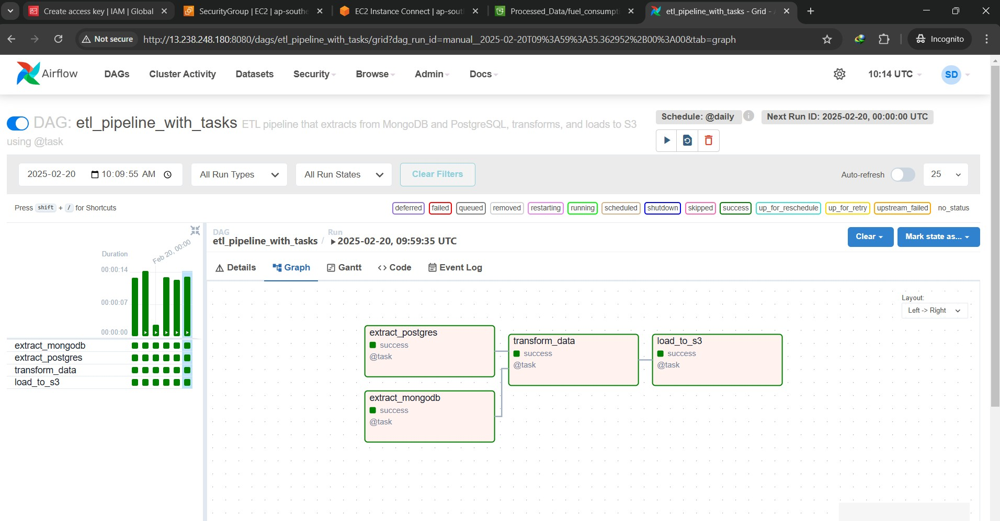

# ETL Data Pipeline Project

## Project Overview

The project involves building an end-to-end ETL (Extract, Transform, Load) data pipeline that extracts data from MongoDB and AWS RDS (PostgreSQL), performs validation and transformation, merges data on specific columns, and finally loads the processed data into an AWS S3 bucket.

## Technologies & Tools Used

- **Databases:** MongoDB, AWS RDS (PostgreSQL)
- **Processing & Transformation:** pandas, psycopg2, pymongo
- **Cloud Services:** AWS S3, AWS EC2, IAM
- **Workflow Orchestration:** Apache Airflow
- **Automation & CI/CD:** GitHub Actions
- **Other:** boto3, pytest, Docker

## Workflow Breakdown

### 1. Integrating Apache Airflow

The ETL pipeline is orchestrated using Apache Airflow with the following components:

- **DAG Definition:** A Directed Acyclic Graph (DAG) manages the workflow.
- **Tasks:** The DAG consists of four main tasks:
  1. Extract data from the MongoDB server.
  2. Extract data from the AWS RDS (PostgreSQL) database.
  3. Perform data validation and transformation.
  4. Load the final processed data into AWS S3 as a CSV file.

### 2. Setting Up Airflow with Docker

- A `docker-compose.yml` file is used to configure and run Airflow within Docker.
- The Airflow container (`apache/airflow`) manages DAG execution, while a PostgreSQL container (`postgres`) serves as the metadata database to store execution logs, task details, and configurations.

## CI/CD Integration with GitHub Actions

A CI/CD pipeline is implemented to automate testing and deployment of the Airflow-based ETL project to an AWS EC2 instance.

### 1. Continuous Integration (CI) - `run-tests` Job

- **Triggers:** Runs on `push` and `pull_request` events to the `main` branch.
- **Environment:** Executes on `ubuntu-latest`.
- **Steps:**
  1. **Checkout Code:** Pulls the latest project code.
  2. **Set up Python Environment:** Installs Python 3.10.
  3. **Install Dependencies:** Installs required Python packages from `requirements.txt`.
  4. **Run Tests:** Executes unit tests using `pytest` with mock AWS credentials for validation.

### 2. Continuous Deployment (CD) - `deploy-to-ec2` Job

- **Triggers:** Runs only after the CI job (`run-tests`) completes successfully.
- **Environment:** Executes on `ubuntu-latest`.
- **Steps:**
  1. **Configure AWS Credentials:** Uses GitHub Secrets to authenticate AWS services.
  2. **Deploy to EC2 via SSH:**
     - Connects to the EC2 instance using the `appleboy/ssh-action` GitHub Action.
     - Navigates to the deployment directory.
     - **If the repository does not exist:** Clones the repository.
     - **If the repository exists:** Pulls the latest changes.
     - Stops any running Docker containers.
     - Creates a `.env` file with environment variables stored in GitHub Secrets.
     - Starts Airflow services using `docker-compose up -d --build`.
     - Initializes the Airflow metadata database (`airflow db init`).
     - Creates an Airflow admin user if necessary.
     - Restarts Airflow to apply changes.

